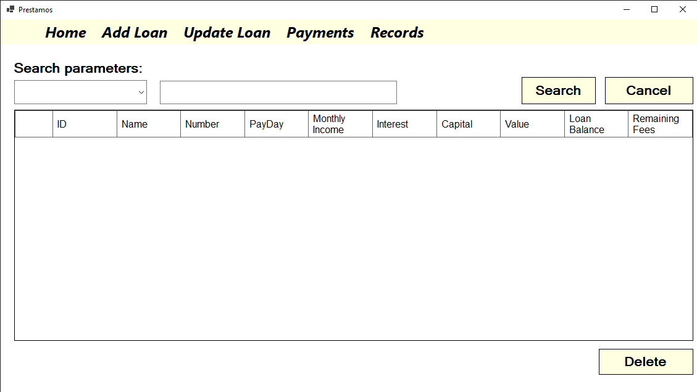
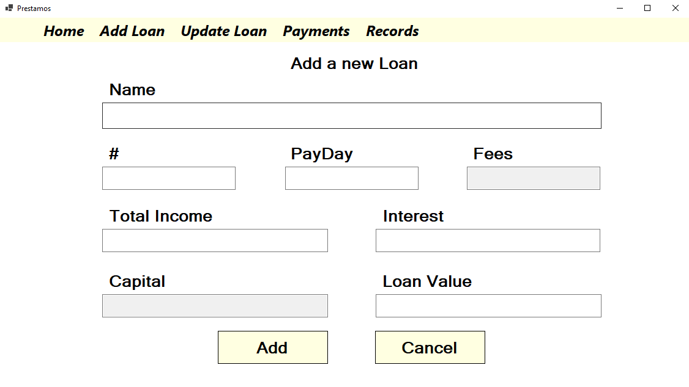
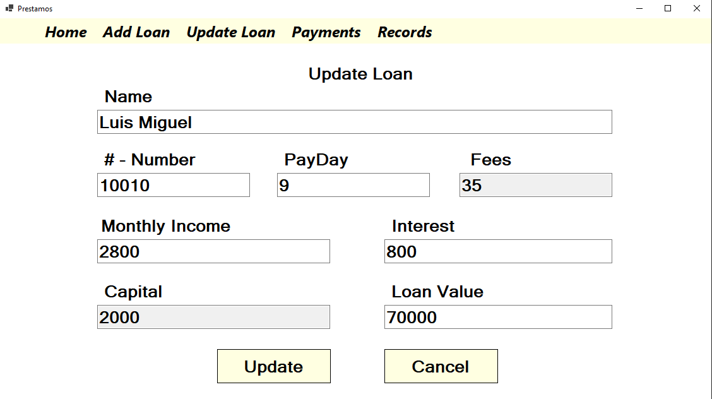
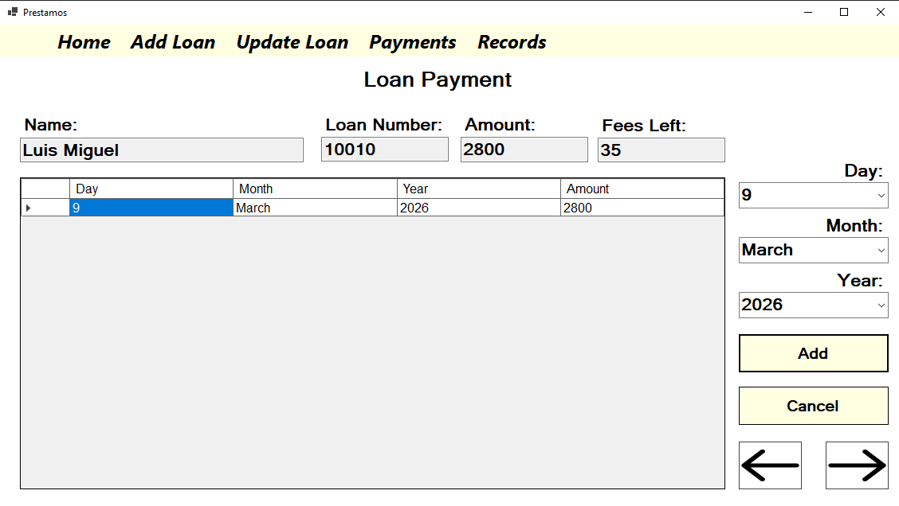
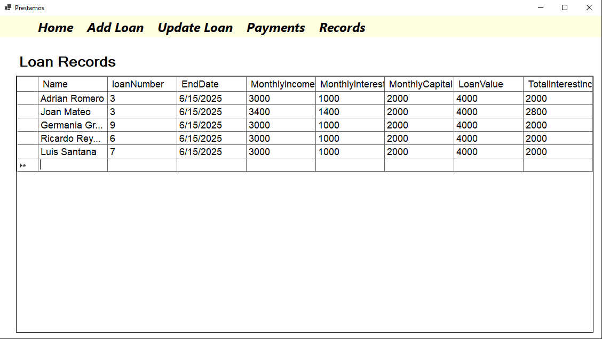

# 💰 LoansApp

Aplicación de escritorio desarrollada en .NET 8 para la gestión de préstamos, diseñada bajo principios de Clean Architecture y orientada a simular un sistema real utilizado en entornos financieros.

---

## 🧾 Descripción

LoansApp es una solución completa para la administración de clientes, préstamos y pagos.
El sistema permite gestionar el ciclo de vida de un préstamo, incluyendo cálculos automáticos de intereses, balances y control de estados.

Una de sus principales ventajas es que utiliza una base de datos local (SQLite), lo que permite su distribución como aplicación portable sin necesidad de instalaciones complejas.

---

## 🧠 Decisiones técnicas

- Se utilizó SQLite para permitir portabilidad sin necesidad de instalar un servidor de base de datos
- Se implementó Clean Architecture para desacoplar la lógica de negocio de la infraestructura
- Se utilizó Entity Framework Core para simplificar el acceso a datos
- Se aplicó inyección de dependencias para mejorar la testabilidad y mantenibilidad

---

## 🏗️ Arquitectura

El proyecto implementa **Clean Architecture** con enfoque **Onion Architecture**, asegurando separación de responsabilidades, mantenibilidad y escalabilidad.

### Capas del sistema:

* **Core.Application**

  * Lógica de negocio
  * Casos de uso
  * DTOs
  * Interfaces
  * Servicios

* **Infrastructure.Persistence**

  * Acceso a datos
  * Configuración de Entity Framework Core
  * Implementación de repositorios

* **UI (Windows Forms)**

  * Interfaz de usuario
  * Interacción con el usuario final

Se aplican principios **SOLID** en toda la solución.

---

## ⚙️ Tecnologías utilizadas

* **Lenguaje:** C#
* **Framework:** .NET 8 (Windows)
* **Interfaz:** Windows Forms
* **Base de datos:** SQLite (local, embebida)
* **ORM:** Entity Framework Core
* **Mapeo de objetos:** AutoMapper
* **Inyección de dependencias:** Microsoft.Extensions.DependencyInjection
* **Configuración y hosting:** Microsoft.Extensions.Hosting

---

## 🚀 Funcionalidades principales

* Gestión de clientes
* Creación y administración de préstamos
* Registro de pagos
* Cálculo automático de intereses
* Seguimiento de balances

---

## 🧠 Lógica de negocio

El sistema implementa reglas financieras como:

* Cálculo de cuotas
* Intereses acumulados
* Actualización de balance restante
* Persistencia automática de operaciones

---

## 🗄️ Base de datos

La aplicación utiliza **SQLite** como base de datos local.

El archivo de base de datos se genera automáticamente en:

```
%LOCALAPPDATA%/CaneloSoftware/LoansApp/app.db
```

Esto permite que la aplicación funcione sin necesidad de instalar un servidor de base de datos.

---

## ⚙️ Cómo ejecutar el proyecto

### 🔹 Opción 1: Visual Studio

1. Clonar el repositorio:

```bash
git clone https://github.com/Canelo0228/LoansApp.git
```

2. Abrir el archivo `.sln`

3. Ejecutar el proyecto (`F5`)

---

### 🔹 Opción 2: Desde CMD (sin Visual Studio)

1. Instalar el SDK de .NET 8
   👉 https://dotnet.microsoft.com/download

2. Clonar el repositorio:

```bash
git clone https://github.com/Canelo0228/LoansApp.git
cd LoansApp
```

3. Restaurar dependencias:

```bash
dotnet restore
```

4. Ejecutar la aplicación:

```bash
dotnet run --project LoansApp
```

---

## 📦 Generar ejecutable portable

La aplicación puede compilarse como un ejecutable independiente para distribución:

```bash
dotnet publish -c Release -r win-x64 --self-contained true /p:PublishSingleFile=true
```

El ejecutable se generará en:

```
/bin/Release/net8.0-windows/win-x64/publish/
```

Este archivo puede ejecutarse en cualquier máquina Windows sin necesidad de instalar .NET.

---

## 📸 Capturas de pantalla

### 🏠 Pantalla principal


### 💳 Registro de nuevos prestamos


### 💳 Actualizacion de prestamos


### 💳 Registro de pagos


### 💳 Historico de prestamos


---

## 📈 Posibles mejoras

* Implementación de autenticación de usuarios
* Exposición de funcionalidades mediante API REST
* Integración con frontend web (Angular)
* Reportes financieros

---

## 👨‍💻 Autor

**José Ignacio Canelo Rodríguez**
Fullstack Developer (.NET | Angular)
📧 [Josecanelo28@hotmail.com](mailto:Josecanelo28@hotmail.com)
📍 Santo Domingo, República Dominicana
